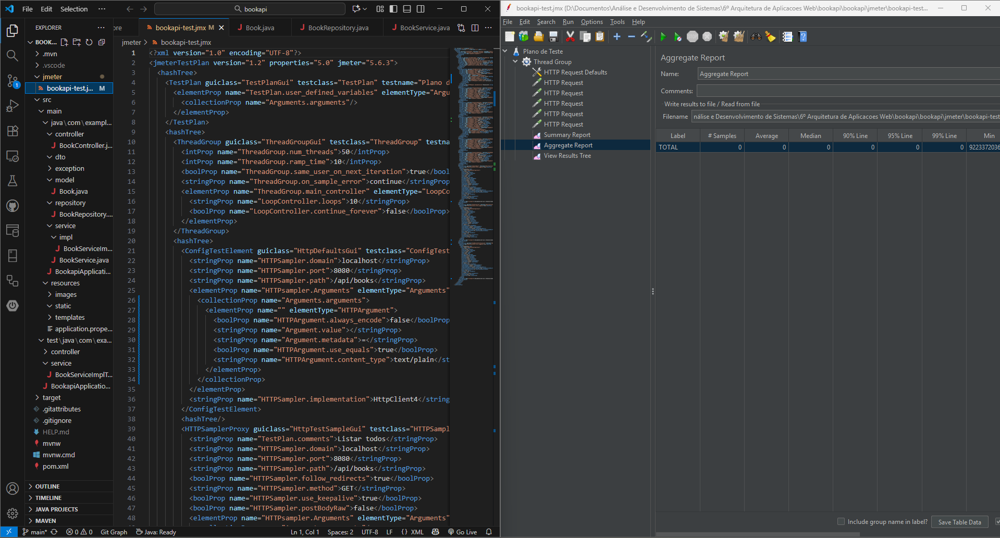
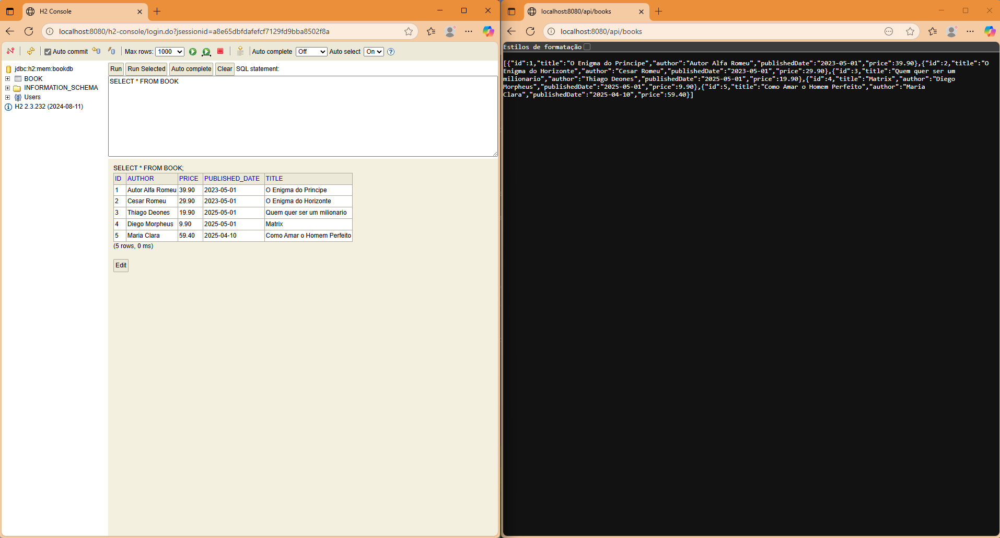

# 📚 BookAPI — Sistema de Gerenciamento de Livros

API RESTfull desenvolvida em **Spring Boot** para o gerenciamento de livros.  
Permite criar, listar, buscar, atualizar e excluir livros no banco de dados. 
Também permite aplicar testes automatizados com Jacoco/Mockito (unitários) e JMeter (desempenho). 

---

## 📘Objetivo

Desenvolver uma API RESTful com operações CRUD completas para uma entidade de sua escolha, utilizando Java com Spring Boot, e aplicar testes automatizados com Mockito (unitários) e JMeter (desempenho). 

📚 **Disciplina:** Arquitetura de Aplicacoes Web 👨‍🏫 **Professor:** Leonardo Vieira Guimarãe 🏫 **Instituição:** Centro Universitário Newton Paiva ✍️ **Aluno:** Douglas Coimbra Laass.

---

## 🚀 Tecnologias Utilizadas

- **Java 17+**
- **Spring Boot 3+**
- **Spring Web**
- **Spring Data JPA**
- **H2 Database** (banco em memória para testes)
- **Lombok** (para reduzir boilerplate de código)
- **JUnit + Mockito** (para testes automatizados)

---

## ⚙️ Configuração do Projeto

**Clone o repositório:**

   ```bash
   git clone https://github.com/CoimbraDouglas/appWebBookapi.git
   cd bookapi
   ```
Execute o projeto (no terminal da IDE):

```
./mvnw spring-boot:run
```

O servidor será iniciado em:

```
http://localhost:8080/api/books
```

Console do banco H2:

```
http://localhost:8080/h2-console
JDBC URL: jdbc:h2:mem:testdb

Username: sa

Password: (em branco, ou você pode alterar em src/main/resources/application.properties)
```

---

🧱 Estrutura da API
```
Método	Endpoint	Descrição
POST	/api/books	Cria um novo livro
GET	/api/books	Lista todos os livros
GET	/api/books/{id}	Busca um livro por ID
PUT	/api/books/{id}	Atualiza um livro existente
DELETE	/api/books/{id}	Exclui um livro
```

---

🧪 Testes da API (PowerShell)

Recomenda-se o uso do PowerShell com o comando **Invoke-RestMethod** para validar os endpoints da aplicação quando for utilizar o curl.
A seguir estão todos os testes CRUD em sequência, prontos para execução.

**Plano de teste do JMeter (.jmx):** O arquivo se encontra em: 

```
jmeter/bookapi-test.jmx
```

**Plano de teste unitário (.exe):** O arquivo se encontra em:

```
target/jacoco.exe
```

---

🟢 1️⃣ Criar um livro (POST)
```powershell

$body = @{
    title = "O Enigma do Príncipe"
    author = "Autor Alfa Romeu"
    publishedDate = "2023-05-01"
    price = 39.90
} | ConvertTo-Json

$response = Invoke-RestMethod -Uri "http://localhost:8080/api/books" `
    -Method POST `
    -Body $body `
    -ContentType "application/json"

$response | ConvertTo-Json -Depth 5
```

Resposta esperada:

```json

{
  "id": 1,
  "title": "O Enigma do Príncipe",
  "author": "Autor Alfa Romeu",
  "publishedDate": "2023-05-01",
  "price": 39.9
}
```
📚 2️⃣ Listar todos os livros (GET)

```powershell

$response = Invoke-RestMethod -Uri "http://localhost:8080/api/books" -Method GET
$response | ConvertTo-Json -Depth 5
```

🔍 3️⃣ Buscar um livro por ID (GET /{id})

```powershell

$id = 1
$response = Invoke-RestMethod -Uri "http://localhost:8080/api/books/$id" -Method GET
$response | ConvertTo-Json -Depth 5
```

✏️ 4️⃣ Atualizar um livro existente (PUT)
```powershell

$id = 1
$body = @{
    title = "O Enigma do Príncipe (Edição Revisada)"
    author = "Autor Alfa Romeu"
    publishedDate = "2024-01-10"
    price = 42.50
} | ConvertTo-Json

$response = Invoke-RestMethod -Uri "http://localhost:8080/api/books/$id" `
    -Method PUT `
    -Body $body `
    -ContentType "application/json"

$response | ConvertTo-Json -Depth 5
```

🗑️ 5️⃣ Excluir um livro (DELETE)
```powershell

$id = 1
Invoke-RestMethod -Uri "http://localhost:8080/api/books/$id" -Method DELETE
Write-Host "✅ Livro com ID $id removido com sucesso."
```

⚙️ 6️⃣ Verificar detalhes de resposta HTTP
Se quiser visualizar o status code e cabeçalhos da resposta, use:

```powershell

$response = Invoke-WebRequest -Uri "http://localhost:8080/api/books" -Method GET
$response.StatusCode
$response.Headers
$response.Content
```

🧰 Dica Extra — Script Completo de Testes Automáticos
Você pode criar um arquivo chamado test-api.ps1 e colar todos os testes acima em sequência.

Depois, basta executar no PowerShell:

```powershell

.\test-api.ps1
```

Isso permitirá testar todos os endpoints da API de forma automatizada, validando se as operações CRUD estão funcionando corretamente.

---
📸 Telas do sistema em execução:

Plano de teste do JMeter (.jmx)


H2-Console e localhost da ApiBooks


---

📘 Conclusão

Este projeto demonstra uma arquitetura REST básica com Spring Boot, aplicando boas práticas de desenvolvimento, separação de camadas (Controller, Service, Repository) e persistência de dados com JPA/H2.

💡 **Dica:** o uso do Invoke-RestMethod é altamente recomendado em ambientes Windows, pois oferece respostas já convertidas em objetos nativos do PowerShell, facilitando a leitura, automação e validação dos endpoints.

--- 

✍️ Autor

Douglas Coimbra
Desenvolvido para fins acadêmicos — disciplina Arquitetura de Aplicações Web.
📅 2025
